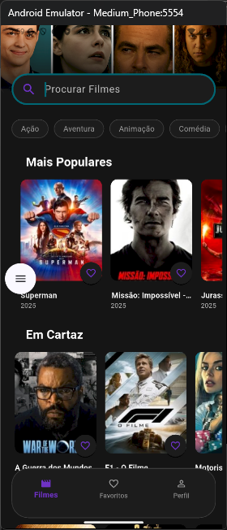

# 🎬 Cinebox Flutter

Aplicativo desenvolvido em **Flutter** que consome a **API do TMDB**, com autenticação via **Google** e gerenciamento de **favoritos**.  
A arquitetura segue o padrão **MVVM (Model-View-ViewModel)**, recomendada pelo Google, garantindo escalabilidade e boas práticas no desenvolvimento.  

---

## ✨ Funcionalidades
- 🔑 Autenticação com Google  
- 🎥 Listagem de filmes a partir da API do **TMDB**  
- ⭐ Favoritos salvos em serviço local (em desenvolvimento)
- 🏗️ Arquitetura **MVVM**  
- 📱 Interface moderna e responsiva  

---

## 🚀 Como rodar o projeto  

1. Clone o repositório:
   ```bash
   git clone https://github.com/TheJoaoVitorio/cinebox_flutter.git
   cd cinebox-flutter
   ```

2. Crie o arquivo `.env` na raiz do projeto com as seguintes variáveis:  
   ```env
   GOOGLE_API_KEY=xxxx
   BACKEND_BASE_URL=xxxx
   THE_MOVIE_DB_API_KEY=xxxx
   THE_MOVIE_DB_BASE_URL=xxxx
   ```

3. Instale as dependências:  
   ```bash
   flutter pub get
   ```
4. informe no arquivo `config.yml` que está na pasta `api` o seu `client_id` do google
   ```bash
   server:
     port: 8080
   log:
     level: 0 # 0: Debug, 1: Info, 2: Warn, 3: Error
   google:
     client_id: xxxxxx
   ```
6. Agora rode o serviço que está na pasta api : `app_filmes_api-windows-amd64.exe`
   - ele será responsável pela autenticação do usuário na aplicação e o salvamento dos filmes favoritos
   

7. Rode o projeto:  
   ```bash
   flutter run
   ```

---

## 📸 Screens  

| Tela Inicial | Detalhes do Filme | Favoritos |
|--------------|-------------------|------------|
|  |  |  |


---

## 👨‍🏫 Créditos  
Projeto de estudo ministrado por **Rodrigo Hahman (GDE)**.  
